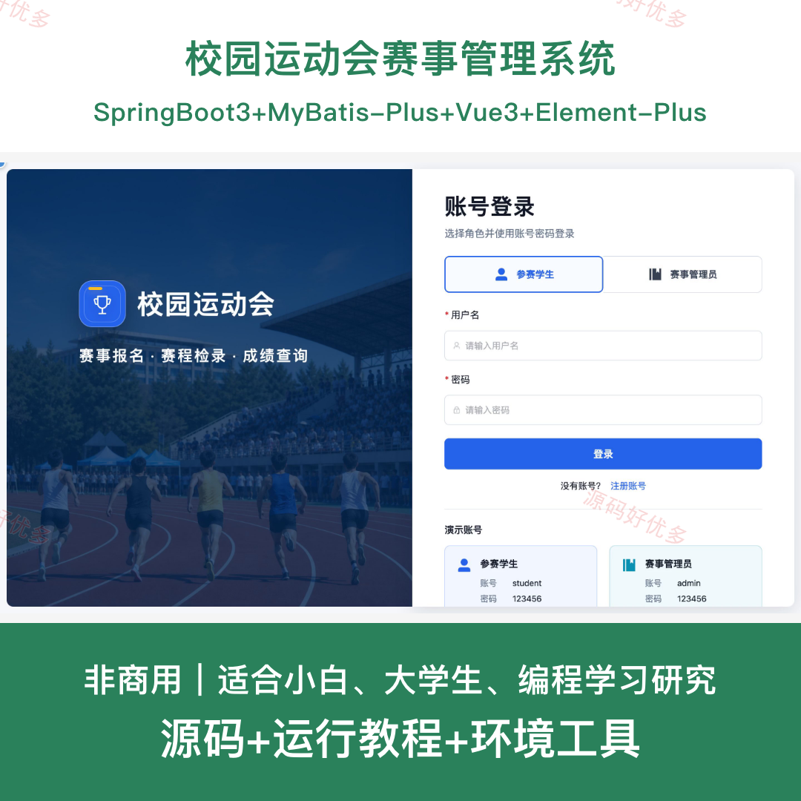
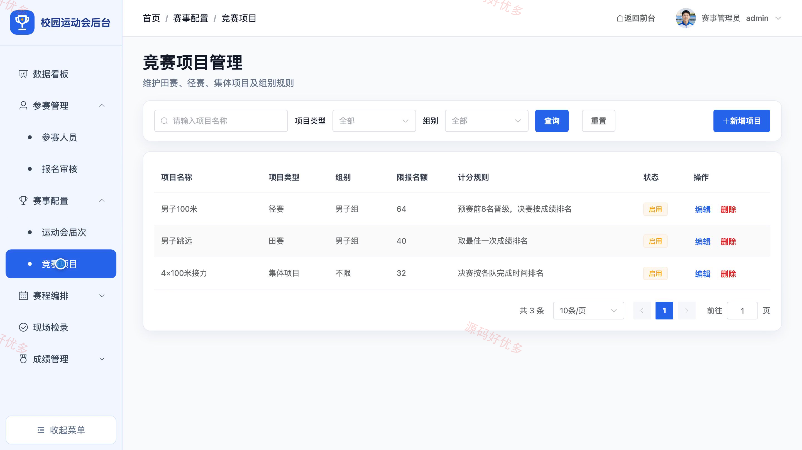
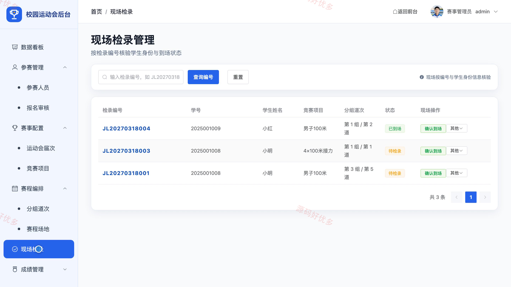
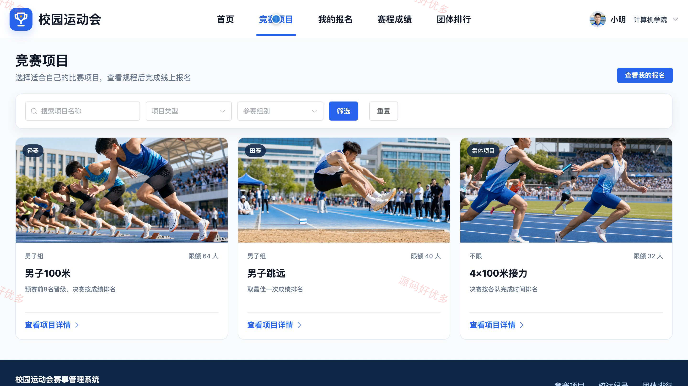

# bs055A
bs055A校园运动会赛事管理系统
## 源码问题查看主页咨询

### 一、关键词
校园运动会、赛事报名、现场检录、赛程成绩、团体排行

### 二、作品包含
源码+数据库+全套环境和工具资源+本地部署教程

### 三、项目技术
前端技术： Html、Css、Js、Vue3.4、Element-Plus
后端技术：Java、SpringBoot3.2.0、MyBatis-Plus

### 四、运行环境（以下版本亲测，其他版本兼容性请自行测试）
开发工具：IDEA/eclipse + VSCODE

数据库：MySQL5.7+（共11张表）

数据库管理工具：Navicat10以上版本

环境配置软件： JDK17 + Maven3.9

前端Nodejs：20

浏览器：谷歌浏览器

### 五、项目介绍
项目编号：bs055A

校园运动会赛事管理系统围绕校运会项目发布、学生报名、审核分组、现场检录、成绩录入与排行发布建立完整流程，让参赛学生能够查询赛事、提交报名并跟踪赛程成绩，赛事管理员统一维护届次、项目、检录和积分纪录。

角色：参赛学生、赛事管理员

参赛学生功能：参赛账号注册与登录、竞赛项目浏览与报名、报名记录查看与撤回、检录编号查看、赛程与成绩查询、团体排行与校运纪录浏览、赛事公告查看、个人资料与密码维护。

赛事管理员功能：赛事数据看板、参赛人员管理、报名审核、运动会届次与竞赛项目管理、分组道次与赛程场地管理、现场检录、成绩录入与晋级管理、积分奖牌与纪录公告管理。

### 六、运行截图

